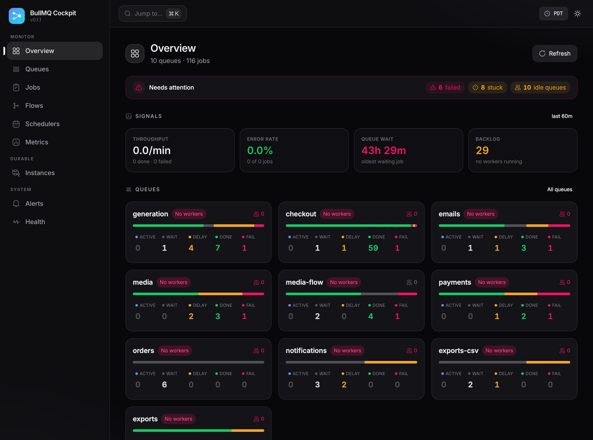
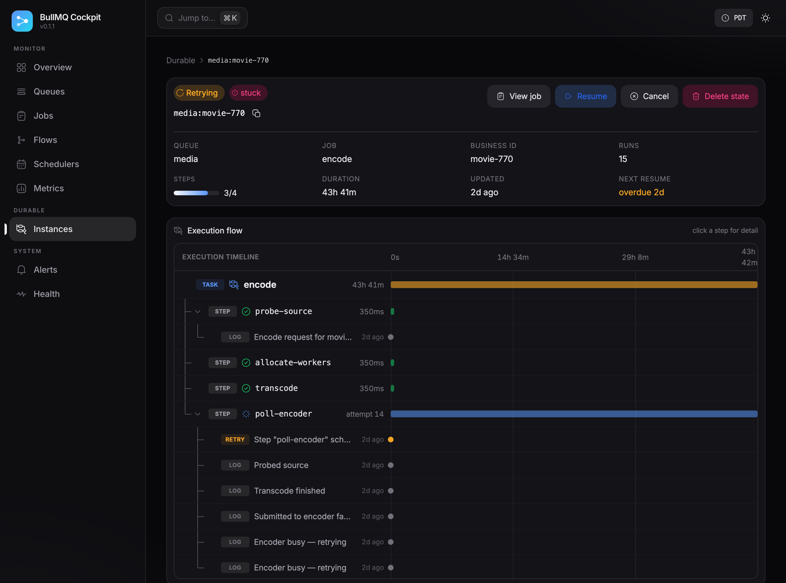

# bullmq-cockpit

Modern dashboard and durable instance inspector for [BullMQ](https://docs.bullmq.io/).



`bullmq-cockpit` is an embeddable, framework-agnostic admin UI for any BullMQ
deployment. It works out of the box for **plain BullMQ** users (queues, jobs,
actions) and lights up a first-class **durable inspector** when it detects
[`bullmq-durable`](../bullmq-durable) state in Redis — step timelines, sleep /
retry / resume controls, and stuck detection.

- **Server**: [Hono](https://hono.dev/) + Zod, mounted under any base path.
- **Client**: React + Vite + TanStack Router/Query/Table + HeroUI + Tailwind.
- **Adapters**: Express, Fastify, NestJS, and a standalone CLI.

---

## Features

**Plain BullMQ**

- **Overview** — the four golden signals at a glance (throughput + sparkline, error
  rate, queue wait, saturation), a worst-first **queue health table**, distribution
  donuts, and a jobs-by-queue chart.
- **Queues** — health/composition, no-worker warnings, pause / resume / drain / clean.
- **Jobs** — status-tabbed list with search, full job detail (data / return / logs /
  stacktrace), **Add job**, **Duplicate**, retry / promote / remove, and **bulk
  retry / remove** via row selection.
- **Flows** — FlowProducer parent → children trees, both on a dedicated **Flows**
  page and rendered inline on every job that participates in one.
- **Schedulers** — repeatable & cron job schedulers: list across queues, add (cron
  pattern or fixed interval), and remove.
- **Metrics** — a per-queue golden-signal deep-dive: throughput over time, **latency
  distribution** (processing p50/p95/max + queue wait) and a **per-job-name**
  breakdown. Throughput uses BullMQ `getMetrics` when the worker opts in, and
  otherwise **derives** everything from recent jobs' timestamps — so latency and
  throughput work even without metrics collection enabled. Plus a **Redis server**
  panel (version, memory, clients, hit-rate) on the Health page.
- **Alerts** — live rules over queue & durable health (failed, backlog, missing
  workers, stuck instances) evaluated server-side, with **Slack / webhook**
  notifications dispatched by a background evaluator on ok→firing transitions.

**Durable** (auto-detected from `bullmq-durable` state — see [Durable inspector](#durable-inspector))

- step flow diagram, sleep / retry / resume controls, synthesized event feed,
  inline durable panel on the job page, and four-class stuck detection.

---

## Quick start (standalone)

```bash
npx bullmq-cockpit --redis redis://localhost:6379 --queues generation,emails --port 3001
# → open http://localhost:3001
```

The CLI auto-discovers queues if `--queues` is omitted. Run `bullmq-cockpit --help`
for every flag (`--base-path`, `--readonly`, `--no-durable`, …).

## Embedding

Every adapter mounts the **same** dashboard under a base path you choose. All
API and asset routes live under that path, so they never collide with your app.

### Express

```ts
import { createBullMQCockpit } from "bullmq-cockpit/express"

app.use(
  "/admin/bullmq",
  createBullMQCockpit({
    connection,
    queues: ["generation", "emails"],
    durable: { enabled: true },
    auth: async ({ req }) => req.user?.role === "admin",
  }),
)
```

### Fastify

```ts
import { createBullMQCockpit } from "bullmq-cockpit/fastify"

await fastify.register(createBullMQCockpit({ connection }), { prefix: "/admin/bullmq" })
```

### NestJS

```ts
import { BullMQCockpitModule } from "bullmq-cockpit/nestjs"

@Module({
  imports: [BullMQCockpitModule.register({ path: "/admin/bullmq", connection })],
})
export class AdminModule {}
```

### Hono (directly)

```ts
import { createCockpitApp } from "bullmq-cockpit"

const { app, context } = createCockpitApp({ connection })
// mount app.fetch wherever you like; call context.close() on shutdown
```

## Options

| Option              | Default            | Description                                                           |
| ------------------- | ------------------ | -------------------------------------------------------------------- |
| `connection`        | —                  | BullMQ/ioredis connection (options or a client). **Required.**       |
| `queues`            | auto-discover      | Explicit queue allow-list.                                           |
| `bullPrefix`        | `"bull"`           | BullMQ key prefix.                                                   |
| `basePath`          | inferred           | Mount path; adapters usually infer it.                              |
| `durable.enabled`   | `true`             | Enable the durable instance inspector.                              |
| `durable.prefix`    | `"bullmq-durable"` | `bullmq-durable` Redis key prefix.                                  |
| `durable.stuckThresholdMs` | `300000`    | Staleness threshold for stuck detection.                            |
| `auth`              | open               | Authorization hook (see below). **Set this in production.**         |
| `readonly`          | `false`            | Disable every mutating action.                                      |

### Auth & permissions

The `auth` hook runs for every request and returns either a boolean or a
principal with explicit permissions:

```ts
auth: async ({ req, header, path, method }) => {
  const user = await getUser(header("authorization"))
  if (!user) return false
  return {
    allowed: true,
    user: { id: user.id, name: user.name, role: user.role },
    permissions: user.role === "admin"
      ? undefined // all permissions
      : ["queue:read", "job:read", "durable:read"], // read-only viewer
  }
}
```

Permissions: `queue:read|write`, `job:read|write`,
`durable:read|resume|retry|cancel|delete`, `dangerous:write` (clean/drain).
In `readonly` mode every write permission is stripped regardless of the hook.

## Durable inspector



When durable support is on, the **Durable** section lists instances with their
derived status (the runtime's coarse `yielded` is split into `sleeping`,
`retrying`, `waiting`). The detail view shows:

- a **step timeline** (`✓ completed · 421ms`, `↻ retrying · attempt 12 · next in 8s`, …),
- per-step result previews, errors, and timings,
- input / output / logs / a synthesized event feed,
- **Resume now**, **Retry**, **Cancel**, and **Delete state** actions.

The **Health** page surfaces stuck instances in four classes: `running_stale`,
`resume_missed`, `orphan_resume_job`, and `orphan_instance`.

## HTTP API

All routes are mounted under `{basePath}/api`:

```
GET  /api/overview                       GET /api/overview/signals
GET  /api/queues                         GET /api/queues/:q
GET  /api/queues/:q/metrics              GET /api/queues/:q/activity
POST /api/queues/:q/{pause,resume,clean,drain}
GET  /api/queues/:q/jobs                 GET /api/queues/:q/jobs/:id
GET  /api/queues/:q/jobs/:id/{logs,dependencies,flow}
POST /api/queues/:q/jobs/:id/{retry,promote,remove,duplicate}
POST /api/queues/:q/bulk/{retry,remove}
GET  /api/flows
GET  /api/schedulers                     GET /api/schedulers/:q
POST /api/schedulers/:q                  POST /api/schedulers/:q/:id/remove
GET  /api/alerts                         (live evaluation of every rule)
POST /api/alerts/rules                   POST /api/alerts/rules/:id/{remove,toggle}
GET  /api/alerts/channels                POST /api/alerts/channels
POST /api/alerts/channels/:id/{remove,test}
GET  /api/durable/instances              GET /api/durable/instances/:id
GET  /api/durable/instances/:id/{steps,events,logs}
POST /api/durable/instances/:id/{resume,retry,cancel,delete}
GET  /api/health                         GET /api/health/{redis,stuck}
```

## Local development

The cockpit reads **real** Redis data — there is no mock mode — so local dev needs
a Redis. The package ships a throwaway one and a seed of demo data, so you can go
from zero to a populated dashboard in one command:

```bash
pnpm --filter bullmq-cockpit demo
# = redis:up  +  seed  +  dev   →  http://localhost:3010
```

Or step by step:

```bash
pnpm --filter bullmq-cockpit redis:up     # docker compose up -d (local Redis on :6379)
pnpm --filter bullmq-cockpit seed         # populate demo data (re-runnable)
pnpm --filter bullmq-cockpit seed --reset # …or wipe Redis first, then seed
pnpm --filter bullmq-cockpit dev          # Hono API (:3011) + Vite (:3010, proxies /api)
pnpm --filter bullmq-cockpit redis:down   # stop Redis (redis:reset wipes the volume)
```

The seed creates a realistic spread so **every** view has something to show:

| Queue                    | What you'll see                                          |
| ------------------------ | -------------------------------------------------------- |
| `emails`, `payments`     | completed + failed jobs (with stacktraces)               |
| `notifications`, `exports-csv` | waiting + delayed jobs                             |
| `generation` (durable)   | completed, sleeping, retrying, failed, cancelled — plus a stuck `running_stale` instance and an `orphan_resume_job` (so the **Health** page lights up) |
| `exports` (durable)      | a second durable queue (completed + sleeping)            |

### Pointing at your own data

Instead of seeding, point the cockpit at the Redis your app/workers already use —
you'll see your real queues, jobs, and durable instances:

```bash
REDIS_URL=redis://localhost:6379 COCKPIT_QUEUES=generation,emails \
  pnpm --filter bullmq-cockpit dev
```

Recognized env vars: `REDIS_URL`, `COCKPIT_QUEUES` (comma-separated; omit to
auto-discover), `COCKPIT_NO_DURABLE=1`, `COCKPIT_DEBUG=1`.

## Build

```bash
pnpm --filter bullmq-cockpit build   # tsup (server) → dist/, then Vite → dist/client
```

The server serves `dist/client` automatically; override with the `clientDir`
option for advanced embedding.

## License

MIT
